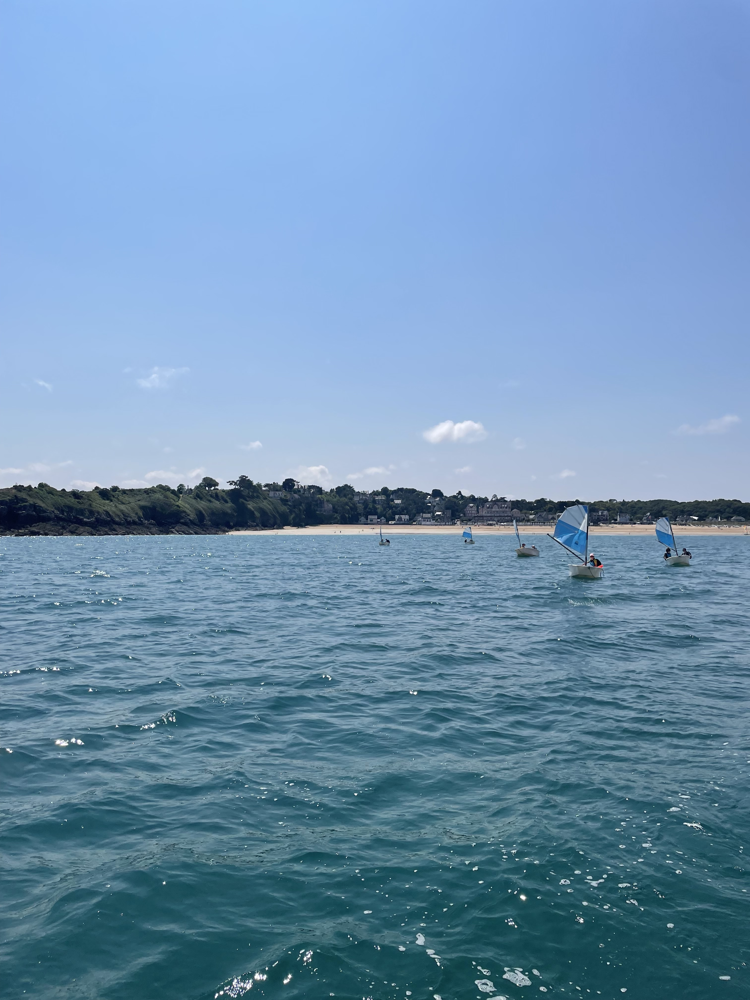

# Oh eh oh eh matelot 1/4 - BreizhGo

| Catégorie  | OSINT       |
|------------|-------------|
| Difficulté | Moyen 🙂    |
| État       | A tester 🎯 |
## Description

Ça y'est ! C'est enfin les vacances !
J'en avais marre de rester là à rien faire, alors je suis monté dans le premier train qui partait !
Le problème... c'est que j'ai même pas pensé à regarder où j'allais en montant, et maintenant je sais pas où je vais m'arrêter...
J'ai réussi à prendre une photo de l'extérieur 📸 et j'aimerais bien retrouver dans quel train j'étais...
Pourrez-vous m'aider à trouver où je suis allé, et le numéro du train qui m'y a emmené ?

- Auteur : DocSystem

## Fichiers

## Indices
1. Recherchez la date et l'heure de prise de la photo...
2. A la SNCF, sauf en périodes de vacances, les trains qui circulent sont les mêmes chaque semaine ;)

## Flag
||`CYBN{Saint-Malo_8087}`||

## Pistes
* Récupérer la date et l'heure de prise de la photo (présente dans les metadata EXIF)
* Déduire du décor sur la photo qu'il s'agit de la gare de Paris Montparnasse (GeoINT)
* Utiliser l'Open Data de la SNCF pour savoir quel train est parti de la gare aux alentours avant l'heure de la photo (13h50)

# Oh eh oh eh matelot 2/4 - Une histoire à l'Ouest

| Catégorie  | OSINT       |
|------------|-------------|
| Difficulté | Facile 😊   |
| État       | A tester 🎯 |
## Description

Wow, je suis quand même allé loin, mais en regardant par où je suis passé, je me suis rendu compte que ça n'aurait pas été possible de faire ce trajet aussi rapidement...

Saurez-vous retrouver le nom de la dernière commune qui était traversée par la ligne grande vitesse qu'a emprunté mon train avant 2017 et la date de la mise en service de cette ligne ?

- Auteur : DocSystem

## Indices
1. Wikipédia est votre ami

## Flag
||`CYBN{Connerré_2017_07_02}`||

## Pistes
* Aller chercher sur les pages Wikipédia des LGV Atlantique et Bretagne-Pays de la Loire

# Oh eh oh eh matelot 3/4 - Un vrai ptit paradis

| Catégorie  | OSINT       |
|------------|-------------|
| Difficulté | Facile 😊   |
| État       | A tester 🎯 |
## Description

Les vacances sont déjà finies... c'était trop bien 🏖️

J'ai pris une photo quand j'étais sur le bateau ⛵ mais j'ai oublié de noter le nom de la ville où je suis allé...

En plus pour une fois, il y avait suffisament de vent pour faire de la voile...

Pourrez-vous retrouver la vitesse (en noeuds) et l'orientation du vent à l'endroit et à l'heure où a été prise la photo, le nom de la ville qu'on voit sur cette dernière, ainsi que l'année de création du club de voile dont je suis parti 🌬️

- Auteur : DocSystem

## Fichiers

## Indices
1. L'historique météorologique de la zone se trouve assez facilement sur internet

## Flag
||`CYBN{Saint-Cast-le-Guildo_7.5_Nord-Ouest_1982}`||

## Pistes
* Faire du GéoINT + combiner au résultat de la partie 1 pour trouver la ville
* Chercher la Diabox du Port de la ville sur Google (on trouve les données météo historiques dessus)

# Oh eh oh eh matelot 4/4 - Nouvelle tête

| Catégorie  | OSINT        |
|------------|--------------|
| Difficulté | Difficile 😠 |
| État       | A tester 🎯  |
## Description

Chaque année, le club de voile forme de nouveaux moniteurs.
Pourrez-vous retrouver le prénom de la monitrice qui a obtenu son diplôme dans ce club en 2021 ?

- Auteur : DocSystem

## Indices
1. Pensez à regarder sur les réseaux sociaux du Club

## Flag
||`CYBN{Ariane}`||

## Pistes
* Chercher sur le compte Instagram du Centre Nautique un post datant de l'été 2021, on y trouve les deux nouveaux diplômés de cette saison dont le compte Instagram est tagué.
