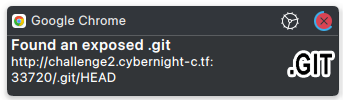
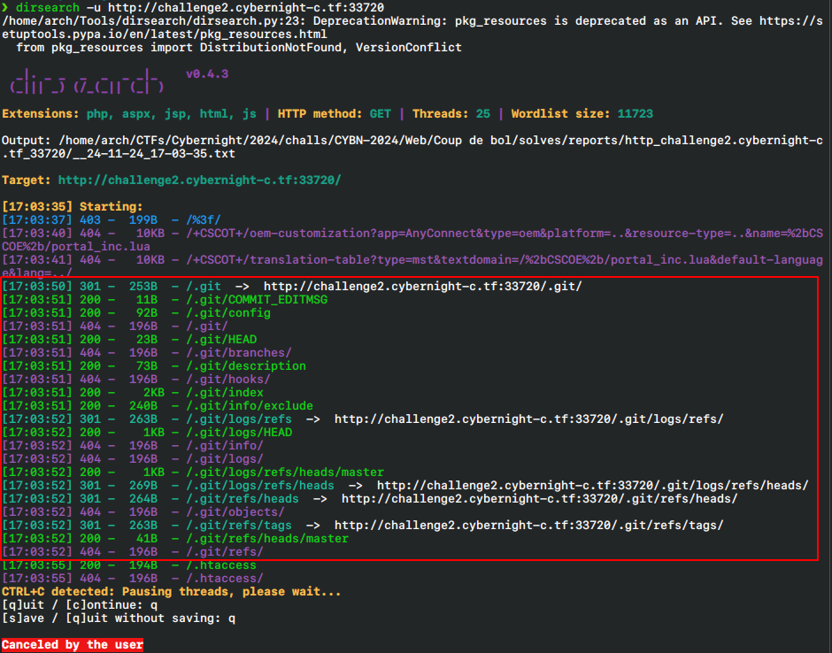
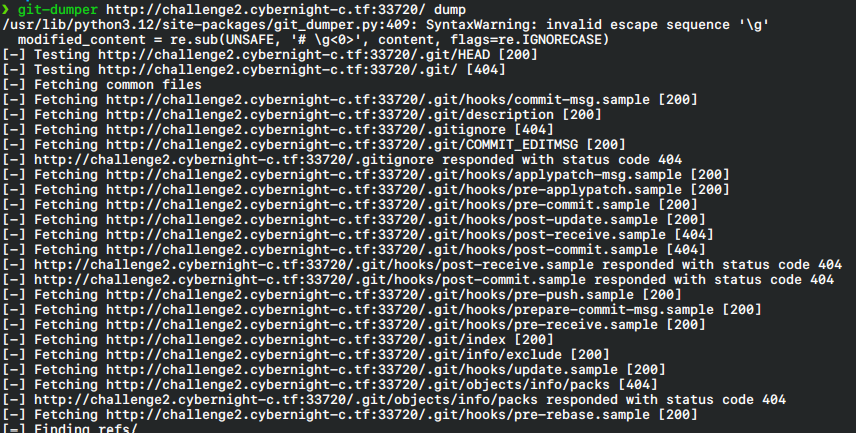
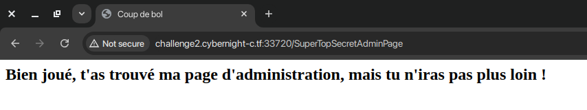
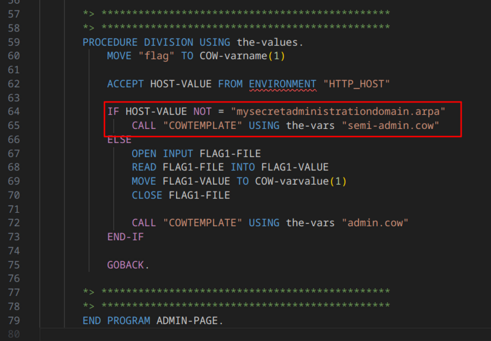
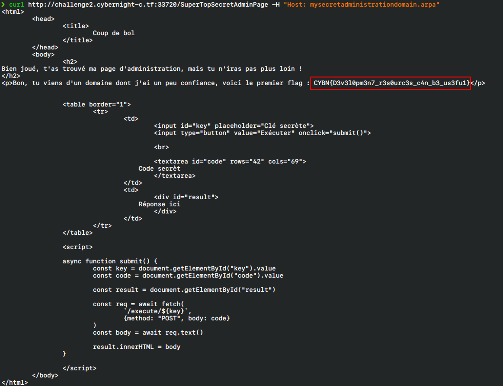
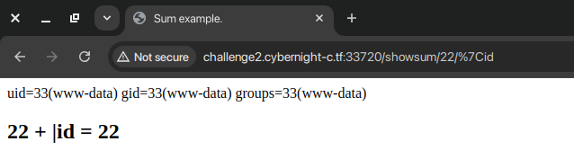

# Coup de bol 1/3 - Gitty Mistake

| Catégorie  | Web      |
|------------|----------|
| Difficulté | Facile 😊 |
| Points       | 128 |
| Résolutions       | 7 |

## Description

Un ami se vante de son nouveau site, prétendant qu'il est infaillible parce qu'il utilise une technologie très ancienne et et qui a fait ses preuves. Peux-tu prouver qu'il a tort en accédant à sa page secrète ?

Note : Outils d'énumération de ressources autorisés.

- Auteur : Romain

## Solution

1. Si vous avez l'extension [DotGit](https://github.com/davtur19/DotGit) sur votre navigateur, une notification mentionnant la présence du dossier `.git` indique le chemin à prendre. Dans le cas contraire, une énumération via [dirsearch](https://github.com/maurosoria/dirsearch), [ffuf](https://github.com/ffuf/ffuf), ... met en évidence ce dossier.

2. Une fois le dossier `.git` trouvé, il est possible de le récupérer via l'extension [DotGit](https://github.com/davtur19/DotGit) ou des outils tels que [GitTools](https://github.com/internetwache/GitTools) et [git-dumper](https://github.com/arthaud/git-dumper).

> **Note** : attention aux dossiers `.git`, ces derniers peuvent être "dangereux", les [hooks](https://git-scm.com/book/ms/v2/Customizing-Git-Git-Hooks) permettent l'exécution de commandes automatiquement lors de certaines commandes git (ex: `.git/hooks/post-checkout` contient les actions à effectuer après un `git checkout`)
> Afin de glisser une petite surprise dans ce challenge, un des commits contient la création d'un lien symbolique liant `.git/hooks/post-checkout` à `./surprise`, aussi, lors d'un `git checkout .`, le contenu de `surprise` (`xdg-open 'https://www.youtube.com/watch?v=dQw4w9WgXcQ' || powershell start chrome 'https://www.youtube.com/watch?v=dQw4w9WgXcQ'`) sera automatiquement exécuté.

> **Avertissement** : ceci étant dit, notez que l'outil [git-dumper](https://github.com/arthaud/git-dumper) exécute automatiquement un `git checkout .` après avoir téléchargé le dossier. Un moyen plus sécurisé pour reconstruire les sources, que ce soit récupérées via [DotGit](https://github.com/davtur19/DotGit), [GitTools](https://github.com/internetwache/GitTools) ou autre, serait d'utiliser `git reset --hard`.

3. Dans les sources, les routes de l'application sont visibles dans le fichier `config.cbl`. Parmi ces routes se trouve `/SuperTopSecretAdminPage`. Toutefois, aucun flag n'est visible lors de la visite de cette page. Une lecture du controller `./controllers/admin.cbl` montre que la page contenant le flag est visible uniquement lorsque l'`Host` est `mysecretadministrationdomain.arpa`. Ainsi, une simple requête curl en passant cet `Host` montre la vraie page admin : `curl http://challenge2.cybernight-c.tf:33720/SuperTopSecretAdminPage -H "Host: mysecretadministrationdomain.arpa"`.

### Flag
||`CYBN{D3v3l0pm3n7_r3s0urc3s_c4n_b3_us3fu1}`||

---

> **Note** : Durant ce CTF, une unintended way a été trouvée impliquant une injection de commande via la fonctionnalité calculatrice. Cette injection réside dans l'ajout, comme entier à calculer, d'un pipe suivi de la commande à exécuter (`/showsum/22/|id`). Le flag est ainsi trouvable directement sur la machine.

